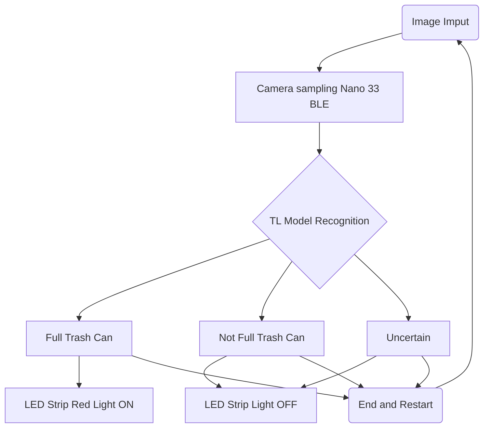

# Trashcan Full Detection
Zhouyu Jiang
* [Github Page](https://github.com/Hypersaki/can-Full-Detection)
* [Edge Impulse Page](https://studio.edgeimpulse.com/studio/394655)

## Introduction
In this project, a Transfer Learning(TL) model is deployed on the device used to whether if the trash can in the kitchen is full or not. A camera installed on the device continuously takes pictures of the inside of the trash can and provides data visualization via an LED Strip. The overall appearance of the project is shown below：

In everyday life, the trash cans in the kitchen are often full and no one clears them. There may be times when this is a self-consciousness on the part of the individual not to clean it up, this detection because through the bright LED strip and high contrast colors can provide an effective reminder. When the inside of a trash can captured through the device is sensed as being full, the LED strip will show a red light.

The MCU used in this project is an Arduino Nano 33 BLE, and a breakout board to connect the OV7675 camera to the LED Strip. The training samples of the model are manually captured pictures. They are uploaded to Edge Impulse platform. After training and deployment, the deployed model is used by the sensor device that senses the interior part of trash cans.

## Research Question
The Trashcan Full Detection project aims to make a visual alarm or notification to people to clean out the kitchen trashcan to maintain the healthy living environments.

## Application Overview
The workflow of this project is similar to most embedded image TL projects. There are three parts in total in the following order: 

### Acquisition of image data & data processing
firstly, the taken pictures will be uploaded and labeled, and stored into the dataset. The data will be initially processed, including converting the image type, resizing the image to a lower resolution (96 x 96) to fit the OV7675.

### Model training & Tuning Parameters
Most of the data in the dataset will be used to train the model, while the rest will be used to validate the model. In this process, the training parameters of the model will be constantly adjusted to get the best training results.

### Deployment & Testing
The model trained on Edge Impulse will be deployed to the Arduino Nano 33 BLE. This MCU will take a picture with the OV7675 to get the image and classify the image, and will make the LED Strip respond with a red light if it detects full trashcan.

## Data
In this project, almost all of my pictures were taken by myself using my cell phone, with a few pictures using my roommate's cell phone. Most of the pictures were taken vertically from a higher angle. Initially, I was going to use 3 categories - "full", "half full" and "empty", However, it was finally neutered down to "fullbin" and "emptybin".

Folders of full and half full trashcan images

### Application Discussion
People may selectively delay and not take out the  when the  can is almost but not quite full. This does not help to improve the kitchen environmentals.
### Technically Discussion
The OV7675, an embedded edge-application camera, is so limited in its ability to take pictures that it can confuse full and not-full situations. This can exacerbate the psychology of selective procrastination.

* Classifying the image data with 4 classifications or 3 classifications will reduce the detection accuracy for the detection. Moreover, it does not fit the application scenario. Therefore, the final image data for this project uses 2 classifications.

## Model
### Why Using Edge Impulse
In this project, since the existing model using TensorFlow via Colab is too large, it requires too much RAM and Flash. The Arduino Nano 33 BLE only has 256KB of RAM and 1MB of ROM, so the model framework I chose was Edge Impulse's MobileNetV1 96x96 0.1 (final layer: 16 neurons, 0.1 dropout).
### Training Settings
The neural network was set up with 20 training cycles, a learning rate of 0.0005, and a batch size of 16. The rest of the values were defaults. This is a relatively optimal solution chosen through multiple model test setups as well as different settings. This setup resulted in a model with 93.9% accuracy and 0.11 loss rate.

Details of the Training Settings

### Settings Explanations
Since the total sample size is relatively small with only 100 samples for each label, the training cycles of 50-100 will not be set as in other projects with large number of samples with many classifications. in addition, Data augmentation is also enabled to improve the accuracy. Since the dataset is relatively small, the batch size is set to 16 instead of the default 32, and a batch size of 16 even performs better than the model trained with a batch size of 32. The TL dataset normally has more distinctive features and it makes more sense to use a lower learning rate than the default value of 0.001. A lower learning rate avoids overfitting and enhances generalization.

## Experiments
### Model selection
Before running EON Tuner, I tried to select MobileNetV1 96x96 0.25, MobileNetV1 96x96 0.2, MobileNetV1 96x96 0.1 in turn, while my first attempt to deploy MobileNetV1 96x96 0.25 failed. As this model is using too much RAM. this will totally make it not work. After trying, both MobileNetV1 96x96 0.2 and MobileNetV1 96x96 0.1 can be deployed on Arduino Nano 33 BLE. The Unoptimized (float 32) version of the MobileNetV1 96x96 0.2 model also could not be successfully deployed on the Arduino Nano 33 BLE due to the peak RAM - 276.9KB being higher than 256KB. After running EON Tuner, I chose the recommended MobileNetV1 96x96 0.1 because the number of classifications for this project is only 2. This means that the detection is not too difficult. Besides, all these models actually have good performance, and choosing the one with less memory requirement can make the device work less stressful.

### Training Settings
After getting the EON Tuner recommended model, I performed many training tests. This included adjusting the training cycles, batch size, and learning rate. All sources of settings and training results can be found in the [image folder](https://github.com/Hypersaki/Trashcan-Full-Detection/tree/main/images/training_settings).

#### Traning Cycles Adjustment
Since I wasn't sure if I wanted to use the usual 50-100 training cycles, I tried to start with 60, and tested 40 and 20, each time getting more reasonable results. Because each time there was a decrease in Accuracy or an increase in Loss. However, I still chose 20 cycles as the final number of training cycles to use, because the high accuracy and low loss from too many cycles may lead to overfitting, which will reduce the generalizability of the model. Moreover, the result of 20 cycles is still decent with a high accuracy of 93.9% and a loss of 0.11.
|Training Cycles|Accuracy|Loss|
|:-:|:-:|:-:|
| 20| 93.9%|0.11|
| 40|93.9%|0.8|
| 60|97.0%|0.7|
----
#### Learning Rate Adjustment
Although previously mentioned use of a lower learning rate in Transfer Learning, I still tested learning rates in 0.001, 0.0005, and 0.0001. You can see that when the learning rate is 0.0001 makes the accuracy higher, but its Loss is much higher than when the learning rate is 0.0005 or 0.0001. This could lead to poor accuracy or generalizability when applied to new data. In the case of 0.0005 and 0.001 it was finally decided to use a learning rate of 0.0005 due to the factors mentioned earlier.
|Learning Rate|Accuracy|Loss|
|:-:|:-:|:-:|
|0.0001| 97%|0.29|
|0.0005|93.9%|0.11|
|0.001|93.9|0.11|
----
#### Batch Size Adjustment
Smaller datasets are better suited with a small batch size, I tested both 16 and 32. And with batch size of 16, the model performs better in Loss.
|Batch Size|Accuracy|Loss|
|:-:|:-:|:-:|
|16|93.9%|0.11|
|32|93.9%|0.17|
----
### Deployment Selection
I tried to deploy the TL model to the Nano 33 MCU via two methods. The first method is to deploy it via Edge Impulse Binary and this was successful. The second method is to build an Arduino Library and then add the zip package to the library via the Arduino IDE. Personally, I preferred the second method, but ultimately failed because I got stuck at the complie stage every time. I needed to edit the code to enable the addition of the LED Strip, which ultimately didn't work. In the end my choice was still to deploy the model to the Nano 33 MCU via the Edge Impluse Binary and get the camera via the serial port to view it on the debug interface, although it didn't make sense for its application.

Deploy as a pre-built firmware

## Result and Observation
Overall, this project didn't quite accomplish my goals. Due to the inability to add the code for the LED Strip to the MCU. This resulted in the entire sensor device not being able to accomplish real-time feedback. However, the model itself was still successful. The screen of the OV7675 was obtained through the serial port and through the debug interface. The camera data can be seen and used to detect whether the trash can is full or not. According to the results of the trained model, the device recognizes full bins very accurately and only rarely fails to recognize empty bins. the Nano 33 is perfectly suited for this kind of recognition with few classifications and uncomplicated image content. If there was more time to continue this project, it is possible that finding out why the Arduino IDE compile failed and implementing the LED Strip would have made this project perfect.

## Bibliography
Arduino Library (no date) Edge Impulse Documentation. Available at: https://edge-impulse.gitbook.io/docs/run-inference/arduino-library (Accessed: 09 May 2024). 
Arduino nano 33 ble sense (no date) Edge Impulse Documentation. Available at: https://edge-impulse.gitbook.io/docs/edge-ai-hardware/mcu/arduino-nano-33-ble-sense (Accessed: 09 May 2024). 
Hayajneh, A.M. et al. (2024) ‘TinyML empowered transfer learning on the edge’, IEEE Open Journal of the Communications Society, 5, pp. 1656–1672. doi:10.1109/ojcoms.2024.3373177. 
Nano 33 ble (no date) docs.arduino.cc. Available at: https://docs.arduino.cc/hardware/nano-33-ble/ (Accessed: 09 May 2024). 

## Declaration of Authorship
I, Zhouyu Jiang, confirm that the work presented in this assessment is my own. Where information has been derived from other sources, I confirm that this has been indicated in the work.

May 09, 2024

Word count: 1534 (main text)
